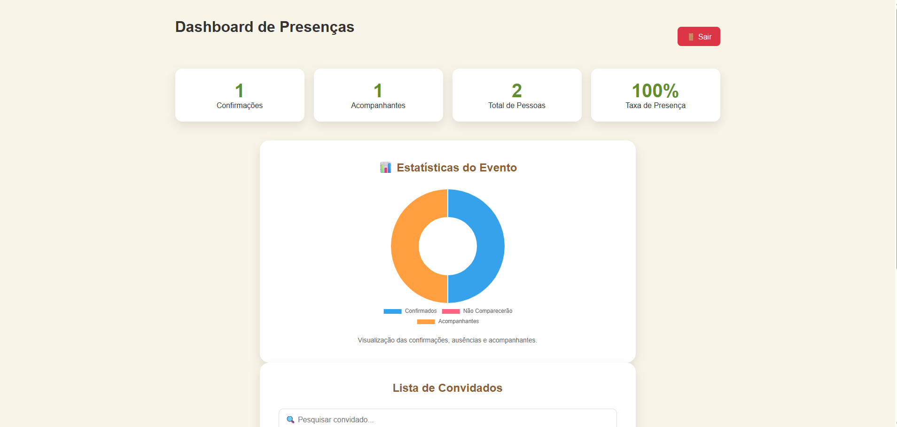

# 🎉 Convite Aniversário Online

Sistema completo de confirmação de presença (RSVP) desenvolvido para gerenciamento de convidados de eventos.

O projeto permite que convidados confirmem presença através de um convite digital moderno e responsivo, enquanto administradores acompanham confirmações em tempo real através de um dashboard protegido por autenticação.

---

## 🚀 Demonstração

🌐 **Aplicação Online**

https://convite-aniversario-9398f.web.app

🔐 **Área Administrativa**

https://convite-aniversario-9398f.web.app/login.html

---

## 📸 Screenshots

<table>
<tr>
<td width="50%">

### 🖥️ Desktop


</td>

<td width="50%">

### 📱 Mobile


</td>
</tr>
</table>

### 🔐 Dashboard Administrativo



---

## ✨ Funcionalidades

### 🎈 Convite Digital

* Contador regressivo para o evento
* Design responsivo para desktop e mobile
* Compartilhamento via WhatsApp
* Tema claro/escuro
* Integração com Google Maps
* Interface moderna com efeito Glassmorphism

### ✅ Sistema RSVP

* Confirmação de presença
* Cadastro de acompanhantes
* Validação de telefone
* Armazenamento em nuvem
* Feedback visual de confirmação

### 🔐 Dashboard Administrativo

* Login protegido com Firebase Authentication
* Listagem de convidados
* Pesquisa em tempo real
* Exclusão de convidados
* Estatísticas de presença
* Exportação CSV
* Gráfico de confirmações utilizando Chart.js

---

## 🛠️ Tecnologias Utilizadas

### Frontend

* HTML5
* CSS3
* JavaScript (ES6 Modules)

### Backend as a Service

* Firebase Authentication
* Firebase Firestore
* Firebase Hosting

### Bibliotecas

* Chart.js
* Font Awesome

---

## 📂 Estrutura do Projeto

```text
convite-aniversario/
│
├── assets/
│   └── images/
│       ├── conviteAniversarioIrmao.jpeg
│       ├── hero-banner_att.png
│       └── hero-banner_mobile.png
│
├── screenshots/
│   ├── pagina_principal_desktop.png
│   ├── pagina_principal_mobile.jpg
│   └── dashboard_administrativo.png
│
├── css/
│   └── style.css
│
├── js/
│   ├── admin.js
│   ├── auth.js
│   ├── countdown.js
│   ├── dashboard.js
│   ├── firebase.js
│   ├── script.js
│   └── theme.js
│
├── pages/
│   ├── admin.html
│   └── dashboard.html
│
├── index.html
├── login.html
├── firebase.json
├── manifest.json
├── 404.html
└── README.md
```

---

## 🔒 Área Administrativa

A área administrativa utiliza Firebase Authentication para proteger o acesso ao dashboard.

### Recursos disponíveis

* Visualizar convidados
* Pesquisar convidados
* Excluir registros
* Exportar lista CSV
* Visualizar estatísticas
* Monitorar confirmações em tempo real

---

## 📊 Dashboard

O painel administrativo exibe:

* Total de convidados
* Total de acompanhantes
* Total de confirmações
* Percentual de presença
* Gráfico de presença
* Lista completa de participantes

---

## 📱 Responsividade

O projeto foi desenvolvido para funcionar em:

* Desktop
* Notebook
* Tablet
* Smartphones Android
* Smartphones iPhone

---

## 🔥 Aprendizados Aplicados

Durante o desenvolvimento foram praticados conceitos como:

* Manipulação de DOM
* JavaScript Modular
* Firebase Authentication
* Firebase Firestore
* Firebase Hosting
* Responsividade Mobile First
* Validação de formulários
* Integração com APIs Web
* Controle de estado da interface
* Arquitetura Frontend baseada em módulos

---

## 🚀 Melhorias Futuras

* [ ] Editar convidados cadastrados
* [x] Excluir acompanhantes individualmente
* [ ] Filtros avançados
* [ ] QR Code para confirmação
* [ ] PWA instalável
* [ ] Relatórios PDF
* [ ] Histórico de alterações
* [ ] Dashboard avançado

---

## 👨‍💻 Autor

**Matheus Samuel**

GitHub:
https://github.com/matheus-samuel-dev

LinkedIn:
https://www.linkedin.com/in/matheus-samuel-dev

---

⭐ Se gostou do projeto, considere deixar uma estrela no repositório.
